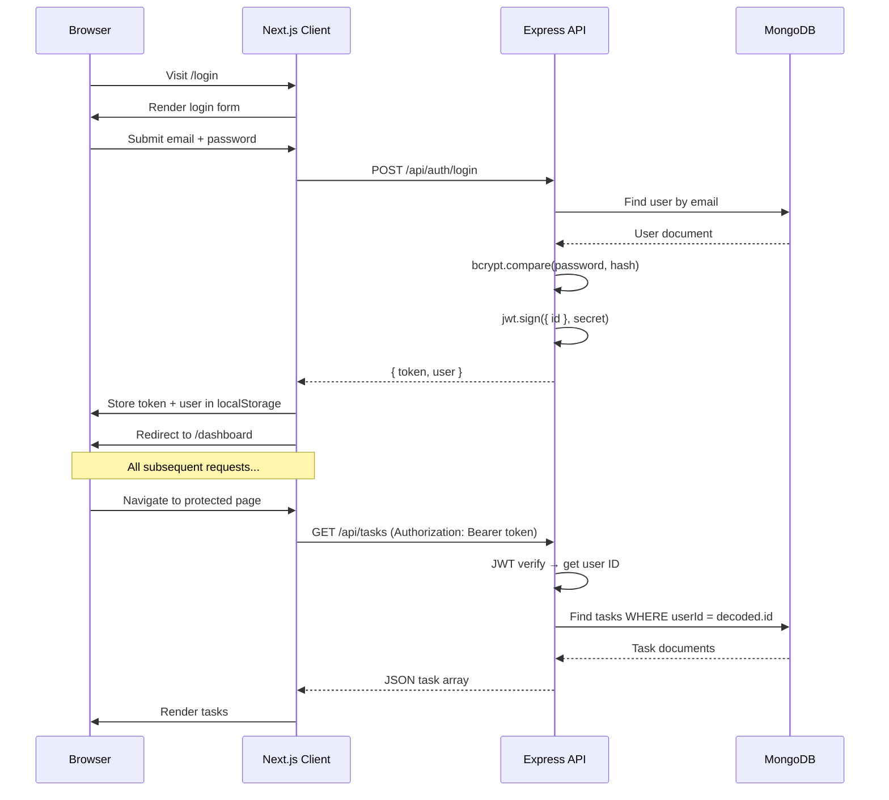
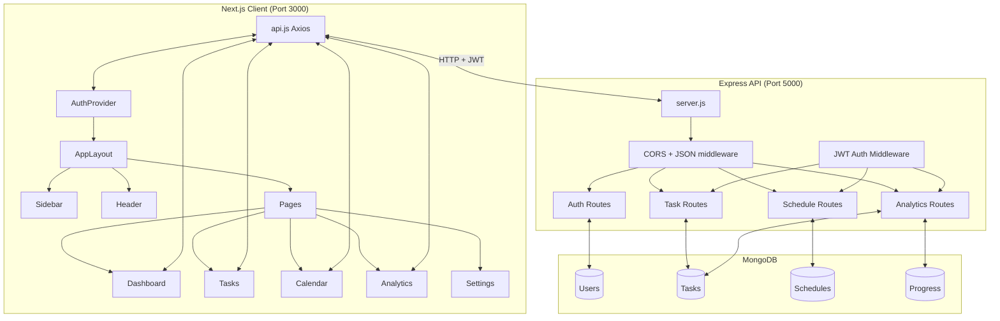

# ZenithTrack — Full Project Documentation

> **ZenithTrack** is an intelligent productivity platform for high-performers. It combines dynamic task management, intelligent scheduling, data-driven analytics, and a gamified RPG theme that turns personal growth into a quest.

---

## Table of Contents

1. [Project Overview](#project-overview)
2. [Tech Stack](#tech-stack)
3. [Folder Structure](#folder-structure)
4. [Getting Started](#getting-started)
5. [Environment Variables](#environment-variables)
6. [Backend (Server)](#backend-server)
   - [Entry Point](#entry-point--serverjs)
   - [Database Config](#database-config--configdbjs)
   - [Authentication Middleware](#authentication-middleware--middlewareauthjs)
   - [Data Models](#data-models)
   - [API Routes](#api-routes)
   - [Seed Script](#seed-script--seedjs)
7. [Frontend (Client)](#frontend-client)
   - [App Layout & Routing](#app-layout--routing)
   - [Auth Context](#auth-context--contextauthcontextjs)
   - [API Layer](#api-layer--libapijs)
   - [Shared Components](#shared-components)
   - [Pages](#pages)
   - [Design System (CSS)](#design-system--globalscss)
8. [Authentication Flow](#authentication-flow)
9. [Data Flow Diagram](#data-flow-diagram)
10. [RPG / Gamification System](#rpg--gamification-system)
11. [API Reference](#api-reference)
12. [Responsive Design](#responsive-design)
13. [Troubleshooting](#troubleshooting)

---

## Project Overview

ZenithTrack is a full-stack web application built with a **Next.js** frontend and an **Express.js + MongoDB** backend. It helps users manage tasks, schedule time blocks, and track their productivity analytics — all wrapped in a gamified RPG theme where completing tasks earns XP, builds streaks, and unlocks achievements.

### Key Features
- **Task Management** — Create, edit, complete, and delete tasks with priorities, categories, and deadlines
- **Time Block Scheduling** — Calendar view with drag-to-create schedule blocks
- **Analytics Dashboard** — Completion trends, category breakdowns, and KPI tracking
- **Gamification** — XP system, level progression, streak tracking, achievement badges
- **User Types** — Scholar (Student), Warrior (Athlete), Mage (Developer) character classes
- **JWT Authentication** — Secure registration and login with token-based auth
- **Responsive Design** — Works on desktop and mobile

---

## Tech Stack

### Frontend
| Technology | Version | Purpose |
|-----------|---------|---------|
| Next.js | 16.1.6 | React framework with App Router |
| React | 19.2.3 | UI component library |
| Axios | 1.13.5 | HTTP client for API requests |
| Recharts | 3.7.0 | Charting library (Line, Bar, Pie, Area) |
| Cinzel Font | — | RPG-style display font |
| Inter Font | — | Primary body font |

### Backend
| Technology | Version | Purpose |
|-----------|---------|---------|
| Express.js | 4.18.2 | REST API server framework |
| MongoDB | — | NoSQL database |
| Mongoose | 8.0.3 | MongoDB ODM (Object Data Modeling) |
| jsonwebtoken | 9.0.2 | JWT token generation & verification |
| bcryptjs | 2.4.3 | Password hashing |
| dotenv | 16.3.1 | Environment variable management |
| cors | 2.8.5 | Cross-origin resource sharing |

---

## Folder Structure

```
ZenithTrack/
├── client/                        # Next.js Frontend
│   ├── src/
│   │   ├── app/                   # Pages (Next.js App Router)
│   │   │   ├── layout.js          # Root layout — wraps everything in AuthProvider
│   │   │   ├── page.js            # Root page — redirects to /login or /dashboard
│   │   │   ├── globals.css        # Global design system (colors, components, animations)
│   │   │   ├── login/page.js      # Login page — "Enter the Realm"
│   │   │   ├── register/page.js   # Register page — "Choose Your Path"
│   │   │   ├── dashboard/page.js  # Dashboard — "Command Center"
│   │   │   ├── tasks/page.js      # Tasks — "Quest Board"
│   │   │   ├── calendar/page.js   # Calendar — "Quest Log"
│   │   │   ├── analytics/page.js  # Analytics — "Character Stats"
│   │   │   └── settings/page.js   # Settings — "The Forge"
│   │   ├── components/            # Shared React components
│   │   │   ├── AppLayout.js       # Auth-guarded layout wrapper
│   │   │   ├── Sidebar.js         # Quest HQ sidebar navigation
│   │   │   └── Header.js          # Top header with streak & XP
│   │   ├── context/
│   │   
│   │   └── lib/
│   │       └── api.js             # Axios instance + API wrappers
│   └── package.json
│
├── server/                        # Express.js Backend
│   ├── config/
│   │   └── db.js                  # MongoDB connection via Mongoose
│   ├── middleware/
│   │   └── auth.js                # JWT authentication middleware
│   ├── models/                    # Mongoose data models
│   │   ├── User.js                # User accounts
│   │   ├── Task.js                # Tasks / Quests
│   │   ├── Schedule.js            # Calendar time blocks
│   │   └── Progress.js            # Daily progress snapshots
│   ├── routes/                    # Express route handlers
│   │   ├── auth.js                # Registration, login, profile
│   │   ├── tasks.js               # CRUD operations for tasks
│   │   ├── schedule.js            # CRUD for schedule blocks
│   │   └── analytics.js           # KPIs, trends, progress data
│   ├── server.js                  # App entry point
│   ├── seed.js                    # Demo data seeder
│   ├── .env                       # Environment variables (DO NOT commit)
│   └── package.json
│
└── package.json                   # Root workspace package
```

---

## Getting Started

### Prerequisites
- **Node.js** v18 or later
- **MongoDB** running locally (default: `mongodb://localhost:27017/zenithtrack`) OR a MongoDB Atlas URI
- **npm** (comes with Node.js)

### Installation

```bash
# 1. Clone the repository
git clone https://github.com/your-username/ZenithTrack.git
cd ZenithTrack

# 2. Install backend dependencies
cd server
npm install

# 3. Configure environment variables
# Copy and edit the .env file (see Environment Variables section below)

# 4. Seed demo data (optional but recommended for first run)
npm run seed

# 5. Start the backend
npm start
# Server runs on http://localhost:5000

# 6. In a NEW terminal, install frontend dependencies
cd ../client
npm install

# 7. Start the frontend
npm run dev
# Client runs on http://localhost:3000
```

### Demo Credentials
After seeding, use these to log in:
- **Email:** `alex@zenithtrack.com`
- **Password:** `password123`

---

## Environment Variables

The backend requires a `.env` file in the `server/` directory:

```env
PORT=5000
NODE_ENV=development
MONGODB_URI=mongodb://localhost:27017/zenithtrack
JWT_SECRET=your_jwt_secret_key_here
JWT_EXPIRE=7d
```

| Variable | Required | Description |
|----------|----------|-------------|
| `PORT` | No | Server port (default: 5000) |
| `NODE_ENV` | No | `development` or `production` |
| `MONGODB_URI` | **Yes** | MongoDB connection string |
| `JWT_SECRET` | **Yes** | Secret key for signing JWT tokens |
| `JWT_EXPIRE` | No | Token expiry duration (default: 7d) |

> **⚠️ Important:** Add `.env` to your `.gitignore` so secrets are never committed.

---

## Backend (Server)

### Entry Point — `server.js`

This is the main file that boots the Express application:

1. **Loads environment variables** via `dotenv`
2. **Connects to MongoDB** via `connectDB()`
3. **Configures middleware:**
   - `cors` — Allows requests from `localhost:3000` and `localhost:3001` with credentials
   - `express.json()` — Parses JSON request bodies
4. **Mounts route handlers:**
   - `/api/auth` → Authentication routes
   - `/api/tasks` → Task CRUD routes
   - `/api/schedule` → Schedule block routes
   - `/api/analytics` → Analytics & KPI routes
5. **Health check endpoint:** `GET /api/health` returns `{ status: 'ok', timestamp }`
6. **Global error handler** catches unhandled errors and returns 500

---

### Database Config — `config/db.js`

A simple async function that:
1. Calls `mongoose.connect()` with the `MONGODB_URI` from `.env`
2. Logs `"MongoDB Connected: <host>"` on success
3. Exits the process with code 1 on failure (so dev tools can detect the crash)

---

### Authentication Middleware — `middleware/auth.js`

The `protect` middleware function secures all private routes:

```
Request → Check Authorization header → Extract Bearer token → Verify JWT → Attach user to req.user → Next
```

**Step-by-step:**
1. Reads `Authorization: Bearer <token>` from the request header
2. If no token is found → returns `401 Not authorized, no token`
3. Verifies the token using `jwt.verify()` with `JWT_SECRET`
4. Looks up the user by the decoded `id` using `User.findById()`
5. If user not found → returns `401 User not found`
6. If valid → sets `req.user` to the found user object and calls `next()`

---

### Data Models

#### User Model — `models/User.js`

Represents a registered user account.

| Field | Type | Details |
|-------|------|---------|
| `name` | String | Required, max 50 characters |
| `email` | String | Required, unique, lowercase, validated with regex |
| `password` | String | Required, min 6 chars, **`select: false`** (excluded by default in queries) |
| `type` | String | Enum: `Student`, `Athlete`, `Developer` (default: `Student`) |
| `preferences.theme` | String | Default: `'dark'` |
| `preferences.notifications` | Boolean | Default: `true` |
| `preferences.focusDuration` | Number | Default: `25` (minutes) |
| `avatar` | String | Default: `''` |
| `createdAt` | Date | Auto-generated |
| `updatedAt` | Date | Auto-generated |

**Hooks & Methods:**
- **Pre-save hook:** Automatically hashes the password with bcrypt (salt rounds: 12) when the `password` field is modified
- **`matchPassword(enteredPassword)`:** Compares a plain-text password against the stored hash using `bcrypt.compare()`

---

#### Task Model — `models/Task.js`

Represents a task (or "quest" in the RPG theme).

| Field | Type | Details |
|-------|------|---------|
| `userId` | ObjectId | Reference to `User` model (required) |
| `title` | String | Required, max 200 chars |
| `description` | String | Optional, max 1000 chars |
| `duration` | Number | Estimated minutes (default: 30, min: 1) |
| `status` | String | Enum: `Pending`, `In Progress`, `Complete` (default: `Pending`) |
| `category` | String | Enum: `one-off`, `habit`, `milestone` (default: `one-off`) |
| `priority` | String | Enum: `low`, `medium`, `high`, `critical` (default: `medium`) |
| `dueDate` | Date | Optional deadline |
| `tags` | [String] | Array of tag strings |
| `subtasks` | [{ title, completed }] | Nested subtask array |
| `completedAt` | Date | Set when marked complete |
| `createdAt` | Date | Auto-generated |
| `updatedAt` | Date | Auto-generated |

**Indexes:**
- `{ userId: 1, status: 1 }` — Fast lookup by user + status
- `{ userId: 1, category: 1 }` — Fast lookup by user + category

**RPG Mapping:**
| Task Field | RPG Concept |
|------------|-------------|
| `category: 'one-off'` | ⚡ Side Quest |
| `category: 'habit'` | 🔄 Daily Quest |
| `category: 'milestone'` | 🏆 Boss Quest |
| `priority: 'low'` | Common (blue border) |
| `priority: 'medium'` | Rare (purple border) |
| `priority: 'high'` | Epic (orange border) |
| `priority: 'critical'` | Legendary (gold border + glow) |

---

#### Schedule Model — `models/Schedule.js`

Represents a calendar time block.

| Field | Type | Details |
|-------|------|---------|
| `userId` | ObjectId | Reference to `User` (required) |
| `taskId` | ObjectId | Reference to `Task` (optional — can link to a task) |
| `title` | String | Required |
| `startTime` | Date | Required |
| `endTime` | Date | Required |
| `isRecurring` | Boolean | Default: `false` |
| `recurrenceRule` | String | Optional (e.g., RRULE format, for future use) |
| `color` | String | Hex color code (default: `#3b82f6`) |
| `description` | String | Default: `''` |

**Index:**
- `{ userId: 1, startTime: 1 }` — Efficient range queries

---

#### Progress Model — `models/Progress.js`

Daily productivity snapshots used for analytics charts.

| Field | Type | Details |
|-------|------|---------|
| `userId` | ObjectId | Reference to `User` (required) |
| `date` | Date | Required — the day this snapshot represents |
| `completionRate` | Number | 0–100 percentage |
| `tasksCompleted` | Number | Default: 0 |
| `totalTasks` | Number | Default: 0 |
| `focusMinutes` | Number | Default: 0 |
| `value` | Number | Default: 0 (used for generic KPI values) |
| `kpiType` | String | Default: `'general'` |

**Index:**
- `{ userId: 1, date: -1 }` — Latest entries first

---

### API Routes

#### Auth Routes — `routes/auth.js`

| Method | Endpoint | Auth Required | Description |
|--------|----------|---------------|-------------|
| `POST` | `/api/auth/register` | No | Create a new user account |
| `POST` | `/api/auth/login` | No | Login with email + password |
| `GET` | `/api/auth/me` | Yes | Get the authenticated user's profile |

**POST /api/auth/register**
```json
// Request Body
{
  "name": "Alex Rivera",
  "email": "alex@zenithtrack.com",
  "password": "password123",
  "type": "Developer"
}

// Success Response (201)
{
  "token": "eyJhbGciOiJIUzI1NiIs...",
  "user": {
    "id": "64abc...",
    "name": "Alex Rivera",
    "email": "alex@zenithtrack.com",
    "type": "Developer",
    "preferences": { "theme": "dark", "notifications": true, "focusDuration": 25 }
  }
}
```

**POST /api/auth/login**
```json
// Request Body
{ "email": "alex@zenithtrack.com", "password": "password123" }

// Success Response (200) — same shape as register response
```

**GET /api/auth/me** — Returns the current user (requires `Authorization: Bearer <token>`)

---

#### Task Routes — `routes/tasks.js`

All routes require authentication (`protect` middleware applied to all).

| Method | Endpoint | Query Params | Description |
|--------|----------|-------------|-------------|
| `GET` | `/api/tasks` | `status`, `category`, `priority`, `search` | List user's tasks with optional filters |
| `POST` | `/api/tasks` | — | Create a new task |
| `GET` | `/api/tasks/:id` | — | Get a single task by ID |
| `PUT` | `/api/tasks/:id` | — | Update a task |
| `DELETE` | `/api/tasks/:id` | — | Delete a task |

**Key behavior:**
- When updating a task's `status` to `'Complete'`, the server **automatically sets `completedAt`** to the current timestamp
- When changing status away from `'Complete'`, `completedAt` is set back to `null`
- Tasks are sorted by `createdAt` descending (newest first)
- All queries are **scoped to the authenticated user** (`userId: req.user._id`)

**POST /api/tasks**
```json
// Request Body
{
  "title": "Implement dark mode",
  "description": "Add theme toggle support",
  "duration": 60,
  "category": "one-off",
  "priority": "high",
  "dueDate": "2026-02-20"
}
```

---

#### Schedule Routes — `routes/schedule.js`

All routes require authentication.

| Method | Endpoint | Query Params | Description |
|--------|----------|-------------|-------------|
| `GET` | `/api/schedule` | `start`, `end` (ISO dates) | Get schedule blocks, optionally filtered by date range |
| `POST` | `/api/schedule/block` | — | Create a new time block |
| `PUT` | `/api/schedule/:id` | — | Update a schedule block |
| `DELETE` | `/api/schedule/:id` | — | Delete a schedule block |

**GET /api/schedule?start=...&end=...**
- If `start` and `end` are provided, filters `startTime >= start` and `endTime <= end`
- Populates the linked `taskId` with `title`, `status`, `category` fields
- Results sorted by `startTime` ascending

---

#### Analytics Routes — `routes/analytics.js`

All routes require authentication.

| Method | Endpoint | Query Params | Description |
|--------|----------|-------------|-------------|
| `GET` | `/api/analytics/progress` | `period` (`weekly` or `monthly`) | Get daily progress entries |
| `GET` | `/api/analytics/kpis` | — | Get aggregated KPI metrics |
| `GET` | `/api/analytics/trends` | — | Get 8-week completion trends |

**GET /api/analytics/kpis** — Returns:
```json
{
  "totalTasks": 10,
  "completedTasks": 4,
  "completionRate": 40,
  "weeklyRate": 67,
  "weekTasks": 3,
  "weekCompleted": 2,
  "categoryBreakdown": [
    { "_id": "one-off", "count": 5 },
    { "_id": "habit", "count": 3 },
    { "_id": "milestone", "count": 2 }
  ],
  "priorityBreakdown": [
    { "_id": "high", "count": 2 },
    { "_id": "medium", "count": 3 }
  ],
  "userType": "Developer"
}
```

**GET /api/analytics/trends** — Returns an array of 8 weekly data points:
```json
[
  { "weekStart": "2026-01-06", "weekEnd": "2026-01-13", "total": 5, "completed": 3, "rate": 60 },
  ...
]
```

---

### Seed Script — `seed.js`

Run with `npm run seed` to populate the database with demo data:

1. **Clears all existing data** from User, Task, Schedule, and Progress collections
2. **Creates a demo user:** "Alex Rivera" (`alex@zenithtrack.com` / `password123`, type: Developer)
3. **Creates 10 sample tasks** with varied categories, priorities, and statuses
4. **Creates 5 schedule time blocks** for today (Daily Standup, Auth Implementation, Code Review, Lunch Break, API Development)
5. **Creates 30 days of random progress data** with random completion rates and focus minutes

---

## Frontend (Client)

### App Layout & Routing

**Next.js App Router** is used. All pages live under `src/app/` and are defined by `page.js` files in their respective directories.

#### `layout.js` — Root Layout
- Imports `globals.css` (the entire design system)
- Wraps the entire app in `<AuthProvider>` to provide auth state globally
- Sets page metadata: title, description, keywords

#### `page.js` — Root Page (`/`)
- Checks if user is logged in via `useAuth()`
- If logged in → redirects to `/dashboard`
- If not → redirects to `/login`

---

### Auth Context — `context/AuthContext.js`

A React Context provider that manages authentication state across the entire app.

| Export | Type | Description |
|--------|------|-------------|
| `AuthProvider` | Component | Wraps the app, provides auth state |
| `useAuth()` | Hook | Access `{ user, loading, login, register, logout }` |

**State:**
- `user` — The current user object (or `null` if not logged in)
- `loading` — `true` during initial auth check

**Initialization Flow:**
1. On mount, checks `localStorage` for `zenith_token` and `zenith_user`
2. If both exist, parses the stored user and sets it in state
3. If parsing fails, clears both keys
4. Sets `loading = false`

**Methods:**

| Method | Action |
|--------|--------|
| `login(email, password)` | Calls `POST /api/auth/login`, stores token + user in localStorage and state |
| `register(name, email, password, type)` | Calls `POST /api/auth/register`, stores token + user |
| `logout()` | Clears localStorage, sets user to null, redirects to `/login` |

**Where token is stored:**
- `localStorage.getItem('zenith_token')` — JWT string
- `localStorage.getItem('zenith_user')` — JSON-stringified user object

---

### API Layer — `lib/api.js`

A centralized Axios instance with interceptors and endpoint wrappers.

**Base URL:** `process.env.NEXT_PUBLIC_API_URL` or `http://localhost:5000/api`

**Request Interceptor:**
- Reads `zenith_token` from localStorage
- Attaches it as `Authorization: Bearer <token>` header to every request

**Response Interceptor:**
- On `401 Unauthorized` response:
  - Clears `zenith_token` and `zenith_user` from localStorage
  - Redirects to `/login`

**Exported API Objects:**

```javascript
authAPI.register(data)    // POST /api/auth/register
authAPI.login(data)       // POST /api/auth/login
authAPI.getMe()           // GET  /api/auth/me

tasksAPI.getAll(params)   // GET    /api/tasks
tasksAPI.getById(id)      // GET    /api/tasks/:id
tasksAPI.create(data)     // POST   /api/tasks
tasksAPI.update(id, data) // PUT    /api/tasks/:id
tasksAPI.delete(id)       // DELETE /api/tasks/:id

scheduleAPI.getAll(params)   // GET    /api/schedule
scheduleAPI.create(data)     // POST   /api/schedule/block
scheduleAPI.update(id, data) // PUT    /api/schedule/:id
scheduleAPI.delete(id)       // DELETE /api/schedule/:id

analyticsAPI.getProgress(period) // GET /api/analytics/progress?period=...
analyticsAPI.getKPIs()           // GET /api/analytics/kpis
analyticsAPI.getTrends()         // GET /api/analytics/trends
```

---

### Shared Components

#### `AppLayout.js` — Protected Layout Wrapper

Used by all authenticated pages (dashboard, tasks, calendar, analytics, settings).

**What it does:**
1. Reads `user` and `loading` from `useAuth()`
2. If still loading → shows a centered loading spinner
3. If not loading and no user → redirects to `/login` via `router.replace()`
4. If authenticated → renders `<Sidebar />` + main content area

**Rendering structure:**
```
<div class="app-layout">
  <Sidebar />
  <div class="main-area">
    {children}  ← page content goes here
  </div>
</div>
```

---

#### `Sidebar.js` — Quest HQ Navigation

The left sidebar present on all authenticated pages.

**Features:**
- **Brand:** ⚔️ icon + "ZenithTrack" in Cinzel RPG font
- **XP Progress Bar:** Calculates `totalXP = completedTasks × 25`, shows level and XP bar
- **Quest Hub Navigation:**
  - 🏰 Command Center → `/dashboard`
  - ⚔️ Quests → `/tasks`
  - 📜 Quest Log → `/calendar`
  - 📊 Stats → `/analytics`
- **System Navigation:**
  - 🛠 The Forge → `/settings`
- **User Profile:** Shows avatar initials, name, and character class
- **Active state:** Current page link gets a left orange border indicator
- **Logout:** Click on user profile to log out

---

#### `Header.js` — Quest Status Bar

Fixed header bar at the top of every authenticated page.

**Props:**
- `title` — Page title (e.g., "🏰 Command Center")
- `subtitle` — Subtitle text

**Features:**
- **Streak Counter:** Shows "🔥 3-day streak" with animated flame
- **Notification Bell:** 🔔 with animated red dot
- **Search Button:** 🔍
- **Greeting:** "Evening, **Alex**" (time-sensitive, uses user's first name)

---

### Pages

#### Login — `/login`

**Visual Theme:** "Enter the Realm" with dark background, floating orange/green orbs, and shield motif.

**Functionality:**
1. User enters email + password
2. On submit → calls `login(email, password)` from AuthContext
3. Success → redirects to `/dashboard`
4. Error → shows error banner with message
5. Shows demo credentials at the bottom in a "scroll" styled box

---

#### Register — `/register`

**Visual Theme:** "Choose Your Path" with character class selection.

**Character Class Selection (3 options):**
| Class | Icon | Label | Internal Value |
|-------|------|-------|---------------|
| Scholar | 🎓 | Scholar | `Student` |
| Warrior | ⚔️ | Warrior | `Athlete` |
| Mage | 🧙‍♂️ | Mage | `Developer` |

**Fields:** Adventurer Name, Email, Secret Passphrase, Character Class

---

#### Dashboard — `/dashboard` (Command Center)

The main landing page after login. Fetches KPIs, tasks, and schedule on mount.

**Sections:**

1. **Quest Status Banner** — Welcome message, level, total XP, quests completed
2. **Bento Grid Stats** (4-column CSS grid):
   - **Large card (2×2):** SVG Progress Ring showing overall completion percentage
   - **Medium cards:** Quests Completed, Weekly Rate, Total Quests, Focus Score
3. **Two-column bottom:**
   - **Active Quests:** Last 5 tasks with rarity borders and XP rewards
   - **Quest Log Timeline:** Today's schedule entries with colored dots

**Special Interactions:**
- Clicking a task toggles its completion status
- Completing a task triggers a **confetti burst animation** (30 CSS particles)

**XP Calculation:**
```
totalXP = completedTasks × 25
level = floor(totalXP / 100) + 1
xpInLevel = totalXP % 100
focusScore = min(100, completedTasks × 12)
```

---

#### Tasks — `/tasks` (Quest Board)

Full task management page.

**Filter Tabs:**
| Tab | Filter | Icon |
|-----|--------|------|
| All Quests | `all` | 🗡 |
| Side Quests | `one-off` | ⚡ |
| Daily | `habit` | 🔄 |
| Boss | `milestone` | 🏆 |

**Each Quest Card Shows:**
- Checkbox (🛡 fills with green on complete, with spring animation)
- Title (with strikethrough on complete)
- Description (if present)
- Category badge (colored)
- Priority dot + label
- XP Reward badge (gold)
- Duration
- Due date (if set)
- Edit/Delete actions (appear on hover)

**XP Reward Calculation:**
```
baseXP = task.duration (or 25 if not set)
multiplier = critical: 3×, high: 2×, medium: 1.5×, low: 1×
reward = round(baseXP × multiplier)
```

**Task Creation/Edit Modal:**
- Quest Name (text input)
- Quest Details (textarea)
- Quest Type (dropdown: Side Quest, Daily Quest, Boss Quest)
- Difficulty (dropdown: Common, Rare, Epic, Legendary)
- Duration (number input, minutes)
- Deadline (date picker)

**FAB:** Floating ⚔️ button in bottom-right corner for quick task creation

---

#### Analytics — `/analytics` (Character Stats)

Data visualization page with charts and achievements.

**Stat Cards (RPG-themed):**
| Card | Label | Data Source |
|------|-------|-------------|
| ⚔️ | STR — Quests Done | `completedTasks` |
| 🎯 | INT — Focus Rate | `completionRate` |
| 📈 | DEX — Completion | `completionRate` |
| 🔥 | VIT — Weekly | `weekCompleted/weekTasks` |

**Charts:**
1. **Quest Completion Trend** — AreaChart with orange gradient (from `analyticsAPI.getProgress`)
2. **Weekly Overview** — BarChart with green (completed) and orange (total) bars (from `analyticsAPI.getTrends`)
3. **Quest Categories** — Donut PieChart (from `categoryBreakdown` in KPIs)

**Achievement Badges:**
| Badge | Icon | Unlock Condition |
|-------|------|-----------------|
| First Quest | ⚔️ | Complete 1 task |
| 3-Day Streak | 🔥 | 3-day streak |
| Warrior | 🏅 | Complete 10 tasks |
| Rising Star | 🌟 | Hit 50% completion rate |
| Legend | 👑 | Complete 50 tasks |
| Diamond | 💎 | 100% weekly rate |

Locked badges appear greyed out (CSS `filter: grayscale(1) brightness(0.5)`).

**Character Class Display:** Shows the user's class (Scholar/Warrior/Mage) with icon and description.

---

#### Calendar — `/calendar` (Quest Log)

Monthly calendar view with event management.

**Features:**
- **Month Navigation:** ← Prev / Next → buttons + "⚡ Today" quick jump
- **Calendar Grid:** 7-column CSS grid (Sun–Sat), 6 rows
- **Today's Cell:** Orange glowing number (box-shadow)
- **Events:** Colored tags on calendar cells
  - Each event shows its title with left border and transparent background
  - Max 3 visible per cell, then "+N more" label
  - **Double-click** an event to delete it

**Creating Events:**
Click any calendar cell to open a modal with:
- Quest Name (text)
- Start Time (datetime input)
- End Time (datetime input)
- Rarity Color picker (7 options: Epic, Uncommon, Legendary, Danger, Rare, Common, Mystic)
- Notes (optional textarea)

---

#### Settings — `/settings` (The Forge)

User profile and preference management.

**Sections:**
1. **⚒️ Character Profile:**
   - Adventurer Name (text input)
   - Email (email input)
   - Character Class selector (Scholar/Warrior/Mage cards with glow on select)

2. **🛡️ Quest Preferences:**
   - Dark Mode toggle (emerald green when on)
   - Quest Alerts toggle
   - Focus Duration selector (15, 25, 30, 45, 60 minutes)

3. **Actions:**
   - 🚪 Leave Realm (logout button, red)
   - ⚒️ Forge Changes (save button, orange gradient)

**App Version:** "ZenithTrack v1.0.0 — Forged with 🔥 for adventurers"

> **Note:** Settings changes are currently simulated (shown as saved but not persisted to the backend). The profile update API endpoint would need to be added for full functionality.

---

### Design System — `globals.css`

The CSS file is the single source of truth for all visual styles. It uses CSS custom properties (variables) for theming.

#### Color Palette

| Token | Value | Usage |
|-------|-------|-------|
| `--bg-primary` | `#1A1D23` | Main background |
| `--bg-secondary` | `#22262E` | Cards, secondary areas |
| `--bg-tertiary` | `#2A2F38` | Hover states, third-level |
| `--accent-sunset` | `#FF6B35` | Primary accent (orange) |
| `--accent-emerald` | `#2ECC71` | Success, completion |
| `--accent-xp-gold` | `#FFD700` | XP, rewards, legendary |
| `--accent-rare` | `#9B59B6` | Rare items (purple) |
| `--accent-frost` | `#3498DB` | Common items (blue) |
| `--accent-rose` | `#E74C3C` | Danger, errors |
| `--text-primary` | `#E8E6ED` | Main text |
| `--text-secondary` | `#9B97A3` | Subtle text |
| `--text-muted` | `#6B6775` | Very subtle text |

#### Key Gradients
- **Primary:** Orange → Deep orange → Dark orange
- **Success:** Emerald → Teal
- **XP:** Gold → Warm orange
- **Legendary:** Purple → Blue

#### Animations
| Animation | Usage |
|-----------|-------|
| `springPop` | Checkbox completion bounce |
| `xpGlow` | XP bar shimmer pulse |
| `flameFlicker` | 🔥 streak flame wiggle |
| `levelUp` | Scale + brightness burst |
| `confettiFall` | Confetti particle fall + rotate |
| `orbFloat` | Auth page background orb movement |
| `notifPulse` | Notification dot scale pulse |
| `slideUp` | Card entrance animation |
| `fadeIn` | Opacity fade in |
| `shimmer` | Loading skeleton animation |

---

## Authentication Flow



---

## Data Flow Diagram



---

## RPG / Gamification System

The gamification layer is implemented **entirely on the frontend** — there are no XP or level fields in the database. This makes it easy to customize and doesn't require backend changes.

### XP System
```
XP per completed task = 25
Level = floor(totalXP / 100) + 1
XP within current level = totalXP % 100
```

### Priority → Rarity Mapping
| Priority | RPG Rarity | Border Color | XP Multiplier |
|----------|----------|-------------|---------------|
| `low` | Common | Blue (`#3498DB`) | 1× |
| `medium` | Rare | Purple (`#9B59B6`) | 1.5× |
| `high` | Epic | Orange (`#FF6B35`) | 2× |
| `critical` | Legendary | Gold (`#FFD700`) | 3× |

### Category → Quest Type Mapping
| Category | Quest Type | Icon |
|----------|-----------|------|
| `one-off` | Side Quest | ⚡ |
| `habit` | Daily Quest | 🔄 |
| `milestone` | Boss Quest | 🏆 |

### User Type → Character Class Mapping
| User Type | Class | Icon | Stat Flavor |
|-----------|-------|------|-------------|
| `Student` | Scholar | 🎓 | INT-focused |
| `Athlete` | Warrior | ⚔️ | STR-focused |
| `Developer` | Mage | 🧙‍♂️ | DEX-focused |

---

## Responsive Design

| Breakpoint | Behavior |
|-----------|----------|
| Desktop (>1200px) | Full 4-column grid, sidebar visible, all features shown |
| Tablet (768–1200px) | 2-column grid, bento grid collapses, sidebar visible |
| Mobile (<768px) | 1-column grid, sidebar hidden (off-screen), streak counter hidden, header XP hidden |

The sidebar can be toggled open/closed on mobile by adding the `.open` class.

---

## Troubleshooting

| Issue | Solution |
|-------|---------|
| MongoDB not connecting | Check that MongoDB is running and `MONGODB_URI` is correct in `.env` |
| Login returns 401 | Run `npm run seed` to create the demo user |
| Page shows loading spinner forever | Check that the backend server is running on port 5000 |
| CORS error in console | Ensure frontend is running on `localhost:3000` (matches CORS config) |
| Charts are empty | Run `npm run seed` to populate progress data |
| Style looks wrong | Clear browser cache and reload — CSS might be cached |
| JWT token expired | Re-login — tokens expire after 7 days by default |

---

*Documentation generated on Feb 17, 2026 · ZenithTrack v1.0.0*
